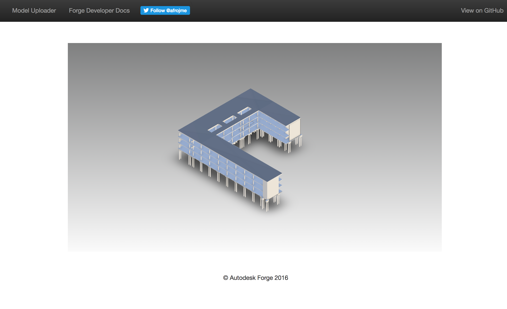

# Viewer - NodeJS - Tutorial


[](https://nodejs.org/)
[](https://www.npmjs.com/)

[](http://opensource.org/licenses/MIT)

[](http://developer.autodesk.com/)
[](http://developer.autodesk.com/)


## Description
This web application implements a basic Node.js server and JavaScript/HTML5 client. It does not demonstrate how to upload a model to the Autodesk server for translation. See instructions below on how to prepare a model to be consumed in this sample.

This sample show a simple integration of the [Viewer](https://developer.autodesk.com/en/docs/viewer/v2/overview/). The front-end will look like:

### Thumbnail


## Dependencies

Install [NodeJS](https://nodejs.org).

Clone this project or download it. It's recommended to install [GitHub desktop](https://desktop.github.com/). To clone it via command line, use the following (<b>Terminal</b> on MacOSX/Linux, <b>Git Shell</b> on Windows):

    git clone https://github.com/Autodesk-Forge/viewer-nodejs-tutorial.git

Apply for your own credentials (API keys) from [developer.autodesk.com](http://developer.autodesk.com)


Now let's set up the dependencies using npm before launching the app by running 
the following command in the project root directory:

```
npm install
```
This will install the following node.js modules in the project:

```
"dependencies": {
    "cookie-parser": "^1.4.3",
    "express": "^4.13.4",
    "bootstrap": "*",
    "express-session": "^1.13.0",
    "font-awesome": "^4.7.0",
    "forge-apis": "^0.4.1",
    "jquery": "*",
    "moment": "*",
    "oauth": "^0.9.14",
    "request": "^2.72.0",
    "serve-favicon": "^2.3.0"
  }

```

As said, this sample does not include the workflow of uploading models to the server.
It depends on other workflow samples to upload models and retrieve the model URNs, as explained in the Setup/Usage Instructions.


## Let's setup our Node.js server
We will be using Express for our server

In our Server folder we can find the following files. 

- config.js
- oauth.js
- server.js
- token.js

Let's go over them to understand better how our server is being set up. 

### config.js

We are defining our ENV variables here, at the time of running our Express server the values on these variables will be use to connect to the different Autodesk Forge services we will need. 

Here we can find the reference to the callback URL which is needed if we use a 3 legged Token for the authentication, in this case we will use a 2 legged authentication, this value can be left out empty. Later on we have a way to pass in our enviornment variables by defining them as Process variables or hard coding them as strings, my suggestion will be to use the process setup. 

Last we see there are 2 definitions about scopes. These scopes give our Token the right permission for the use of the different services of the Forge We Services. This tutorial is dedicated to the use of the Viewer only, we will only need the "viewables:read" scope.

``` js 
'use strict'; // http://www.w3schools.com/js/js_strict.asp

module.exports = {

  // Autodesk Forge configuration

  // this this callback URL when creating your client ID and secret
  callbackURL: process.env.FORGE_CALLBACK_URL || 'YOURCALLBACKURL',

  // set environment variables or hard-code here
  credentials: {
    client_id: process.env.FORGE_CLIENT_ID || '',
    client_secret: process.env.FORGE_CLIENT_SECRET || ''
  },

  // Required scopes for your application on server-side
  scopeInternal: ['data:read','data:write','data:create','data:search'],
  // Required scope of the token sent to the client
  scopePublic: ['viewables:read']
};
``` 

### oauth.js

This file takes care of creating the express router we need to call the NPM function "AuthClientTwoLegged" to get a 2 legged Client authentication token. Here we will use the ENV variables from the previous config.js file.

``` js
/////////////////////////////////////////////////////////////////////////////////
//
// Obtaining our Token 
//
/////////////////////////////////////////////////////////////////////////////////
'use strict'; // http://www.w3schools.com/js/js_strict.asp
// token handling in session
var token = require('./token');

// web framework
var express = require('express');
var router = express.Router();

// Forge NPM
var forgeSDK = require('forge-apis');

// Forge config information, such as client ID and secret
var config = require('./config');

// wait for Autodesk callback (oAuth callback)
router.get('/user/token', function (req, res) {

    try {
      var client_id = config.credentials.client_id;
      var client_secret = config.credentials.client_secret;
      var scopes = config.scopePublic;
      
      var req = new forgeSDK.AuthClientTwoLegged(client_id, client_secret, scopes);
      req.authenticate()
          .then(function (credentials) {

            console.log('Token: ' + credentials.access_token);
            res.json({ access_token: credentials.access_token, expires_in: credentials.expires_in });

          })
          .catch(function (error) {
            res.status(500).end(error.developerMessage);
          });
    } catch (err) {
        res.status(500).end(err);
    }
});

module.exports = router;

```

### server.js

Here we will perform a couple of actions. First we are going to store our token in a session followed by server routing of the npm modules using static redirect, and at last redirect our oauth API calls. 

``` js

'use strict';

var express = require('express');
var cookieParser = require('cookie-parser');
var session = require('express-session');
var app = express();

// this session will be used to save the oAuth token
app.use(cookieParser());
app.set('trust proxy', 1) // trust first proxy - HTTPS on Heroku 
app.use(session({
    secret: 'autodeskforge',
    cookie: {
        httpOnly: true,
        secure: (process.env.NODE_ENV === 'production'),
        maxAge: 1000 * 60 * 60 // 1 hours to expire the session and avoid memory leak
    },
    resave: false,
    saveUninitialized: true
}));

// prepare server routing
app.use('/', express.static(__dirname + '/../www')); // redirect static calls
app.use('/js', express.static(__dirname + '/../node_modules/bootstrap/dist/js')); // redirect static calls
app.use('/js', express.static(__dirname + '/../node_modules/moment/min')); // redirect static calls
app.use('/js', express.static(__dirname + '/../node_modules/jquery/dist')); // redirect static calls
app.use('/css', express.static(__dirname + '/../node_modules/bootstrap/dist/css')); // redirect static calls
app.use('/css', express.static(__dirname + '/../node_modules/font-awesome/css')) // redirect static calls
app.use('/fonts', express.static(__dirname + '/../node_modules/bootstrap/dist/fonts')); // redirect static calls
app.set('port', process.env.PORT || 3000); // main port

// prepare our API endpoint routing
var oauth = require('./oauth');
app.use('/', oauth); // redirect oauth API calls

module.exports = app;

```

### token.js

Setup of Token prototypes.

``` js
'use strict'; // http://www.w3schools.com/js/js_strict.asp

function Token(session) {
    this._session = session;
}

Token.prototype.getOAuth = function () {
    return this._session.oAuth;
};

Token.prototype.setOAuth = function (oAuth) {
    this._session.oAuth = oAuth;
};

Token.prototype.getCredentials = function () {
    return this._session.credentials;
};

Token.prototype.setCredentials = function (credentials) {
    this._session.credentials = credentials;
};

module.exports = Token;


```

## Model Derivative Uploader
 
Upload one of your models to your account and get its URN using the following project:

  - [Model Derivative Uploader](https://github.com/jaimerosales/modelderivative-nodejs-tutorial) 


## Client side setup

#### Add the URN to your www/js/index.js file

The URN that you will obtain needs to be added to the documentId variable in the following code at line 26, make sure you don't delete the urn word of the string. 

```js

var viewer;
var options = {
    env: 'AutodeskProduction',
    getAccessToken: getForgeToken
}

var documentId = 'urn:YOUR-URN';

Autodesk.Viewing.Initializer(options, function onInitialized() {
    Autodesk.Viewing.Document.load(documentId, onDocumentLoadSuccess, onDocumentLoadFailure);
});

/**
 * Autodesk.Viewing.Document.load() success callback.
 * Proceeds with model initialization.
 */
function onDocumentLoadSuccess(doc) {

    // A document contains references to 3D and 2D viewables.
    var viewable = Autodesk.Viewing.Document.getSubItemsWithProperties(doc.getRootItem(), {
        'type': 'geometry',
        'role': '3d'
    }, true);
    if (viewable.length === 0) {
        console.error('Document contains no viewables.');
        return;
    }

    // Choose any of the available viewable
    var initialViewable = viewable[0]; // You can check for other available views in your model,
    var svfUrl = doc.getViewablePath(initialViewable);
    var modelOptions = {
        sharedPropertyDbPath: doc.getPropertyDbPath()
    };

    var viewerDiv = document.getElementById('viewerDiv');

    ///////////////USE ONLY ONE OPTION AT A TIME/////////////////////////

    /////////////////////// Headless Viewer /////////////////////////////
    // viewer = new Autodesk.Viewing.Viewer3D(viewerDiv);
    //////////////////////////////////////////////////////////////////////

    //////////////////Viewer with Autodesk Toolbar///////////////////////
    viewer = new Autodesk.Viewing.Private.GuiViewer3D(viewerDiv);
    //////////////////////////////////////////////////////////////////////

    viewer.start(svfUrl, modelOptions, onLoadModelSuccess, onLoadModelError);
}


/**
 * Autodesk.Viewing.Document.load() failure callback.
 */
function onDocumentLoadFailure(viewerErrorCode) {
    console.error('onDocumentLoadFailure() - errorCode:' + viewerErrorCode);
}

/**
 * viewer.loadModel() success callback.
 * Invoked after the model's SVF has been initially loaded.
 * It may trigger before any geometry has been downloaded and displayed on-screen.
 */
function onLoadModelSuccess(model) {
    console.log('onLoadModelSuccess()!');
    console.log('Validate model loaded: ' + (viewer.model === model));
    console.log(model);
}

/**
 * viewer.loadModel() failure callback.
 * Invoked when there's an error fetching the SVF file.
 */
function onLoadModelError(viewerErrorCode) {
    console.error('onLoadModelError() - errorCode:' + viewerErrorCode);
}

```

### oauth.js file on the client side

We need this ajax function to call our token endpoint created in our server.

``` js

function getForgeToken(callback) {
  jQuery.ajax({
    url: '/user/token',
    success: function (res) {
      console.log('res de token client', res);
      callback(res.access_token, res.expires_in)
    }
  });

}

```

The last file needed to run the sample will be start.js. This file is simply checking if the ENV variables have been set and starts our server.js file.

``` js
'use strict';

var app = require('./server/server');

// start server
var server = app.listen(app.get('port'), function () {
  if (process.env.FORGE_CLIENT_ID == null || process.env.FORGE_CLIENT_SECRET == null)
    console.log('*****************\nWARNING: Client ID & Client Secret not defined as environment variables.\n*****************');

  console.log('Starting at ' + (new Date()).toString());
  console.log('Server listening on port ' + server.address().port);
});

```

## Run the Tutorial


To run it, install the required packages, set the enviroment variables with your client ID & secret and finally start it. Via command line, navigate to the folder where this repository was cloned and use the following:

Mac OSX/Linux (Terminal)

    npm install
    export FORGE_CLIENT_ID=<<YOUR CLIENT ID FROM FORGE DEVELOPER PORTAL>>
    export FORGE_CLIENT_SECRET=<<YOUR FORGE CLIENT SECRET>>
    npm run dev

Windows (use <b>Node.js command line</b> from Start menu)

    npm install
    set FORGE_CLIENT_ID=<<YOUR CLIENT ID FROM FORGE DEVELOPER PORTAL>>
    set FORGE_CLIENT_SECRET=<<YOUR FORGE CLIENT SECRET>>
    npm run dev

Open the browser: [http://localhost:3000](http://localhost:3000).


## Viewer - Extensions (Extra Step)

If you are done with the display of your translated model. You can start integrating Viewer interaction with custom JS Extensions. 

You can find more extensions to use with the viewer [here](https://github.com/Autodesk-Forge/library-javascript-viewer-extensions)

In your www/js/index.js file, You will find the following simple extensions. Make sure you uncomment the following functions.

``` js

/////////////////////////////////////////////////////////////////////////////////
//
// Load Viewer Background Color Extension
//
/////////////////////////////////////////////////////////////////////////////////

function changeBackground (){
       viewer.setBackgroundColor(0, 59, 111, 255,255, 255);
}

/////////////////////////////////////////////////////////////////////////////////
//
// Unload Viewer Background Color Extension
//
/////////////////////////////////////////////////////////////////////////////////

function resetBackground (){
       viewer.setBackgroundColor(169,169,169, 255,255, 255);
}

/////////////////////////////////////////////////////////////////////////////////
//
// Load Viewer Markup3D Extension
//
/////////////////////////////////////////////////////////////////////////////////
// 3D Markup extension to display values of the selected objects in the model. 

function loadMarkup3D (){
       viewer.loadExtension('Viewing.Extension.Markup3D');
}

/////////////////////////////////////////////////////////////////////////////////
//
// Load Viewer Transform Extension
//
/////////////////////////////////////////////////////////////////////////////////
// Transformation is allowed with this extension to move object selected in the XYZ
// position or rotation in XYZ as well.

function loadTransform (){
       viewer.loadExtension('Viewing.Extension.Transform');
}

/////////////////////////////////////////////////////////////////////////////////
//
// Load Viewer Control Selector Extension
//
/////////////////////////////////////////////////////////////////////////////////
// This extension allows you to remove certain extensions from the original toolbar 
// provided to you.

function loadControlSelector(){
       viewer.loadExtension('_Viewing.Extension.ControlSelector');
}


```

Also in your www/index.html before the script for the viewer index.js file, make sure you have the following files referenced.

``` html	 
	<!-- The Viewer Extensions -->
    <!-- <script src="/extensions/Viewing.Extension.Markup3D.min.js"></script>
    <script src="/extensions/Viewing.Extension.Transform.min.js"></script>
    <script src="/extensions/_Viewing.Extension.ControlSelector.min.js"></script> -->

    <!-- The Viewer JS -->
    <script src="/js/index.js"></script>
    <script src="/js/oauth.js"></script>


```

Inside of the Div Container for your viewer, you will find the following buttons added. Make sure you uncomment the Extension button together with it's div that contains.

``` html
   <div class="container">
        <!-- This is where your viewer should attach -->
        <div class="center-block" id="viewerDiv"></div>
        
        <!-- Extension Buttons -->
        <!-- <div class="row"> 
             
            <div class="myButton" id="background" onclick="changeBackground()">Change Background</div> 
            <div class="myButton" id="background" onclick="resetBackground()">Reset Background</div> 
            <div class="myButton" id="background" onclick="loadMarkup3D()">Markup3D</div>
            <div class="myButton" id="background" onclick="loadTransform()">Transform</div>
            <div class="myButton" id="background" onclick="loadControlSelector()">Control Selector</div>
        </div>  -->
        
    </div><!-- /container -->
```

And last, to have some styling in our new buttons, make sure you uncomment the following code which you can find in your www/css/main.css file.

``` css

h4 {
  color: white;
}

/*.myButton {
      background-color: white;
      color: #4CAF50;
      border: 2px solid #4CAF50;
      border-radius: 8px;
      display:inline-block;
      cursor:pointer;
      font-family:Verdana;
      font-size:17px;
      padding:16px 31px;
      text-decoration:none;
      margin-top: 1em;
      -webkit-transition-duration: 0.4s; 
      transition-duration: 0.4s;
}

.myButton:hover {
      background-color: #4CAF50; 
      color: white;
}

.myButton:active {
      position:relative;
      top:1px;
}*/


```

## Deploy on Heroku

To deploy this project to Heroku, be sure to set your environment variables in the dashboard:

- `FORGE_CLIENT_ID`
- `FORGE_CLIENT_SECRET`

[](https://heroku.com/deploy)

Watch [this video](https://www.youtube.com/watch?v=Oqa9O20Gj0c) on how deploy this sample to Heroku.


## Tips & tricks

For local development/testing, consider use [nodemon](https://www.npmjs.com/package/nodemon) package, which auto restart your node application after any modification on your code. To install it, use:

    sudo npm install -g nodemon

Then, instead of <b>npm run dev</b>, use the following:

    npm run nodemon

Which executes <b>nodemon server.js --ignore www/</b>, where the <b>--ignore</b> parameter indicates that the app should not restart if files under <b>www</b> folder are modified.


## License

That samples are licensed under the terms of the [MIT License](http://opensource.org/licenses/MIT).


## Written by

Jaime Rosales D. <br /> 
[](https://twitter.com/AfroJme) <br />Forge Partner Development <br />
<a href="http://developer.autodesk.com/">Forge Developer Portal</a> <br />

